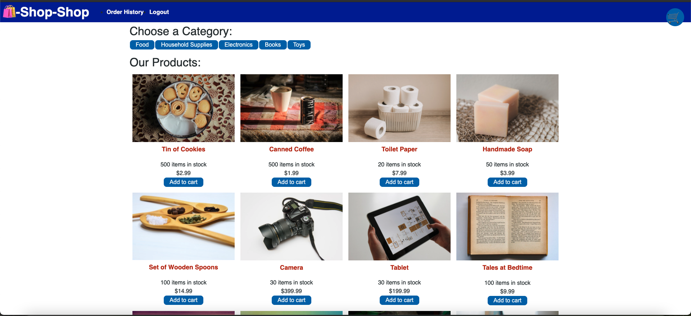
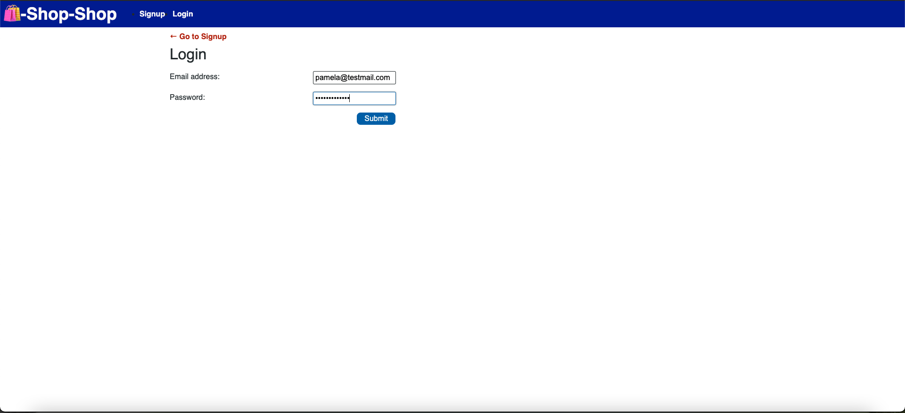
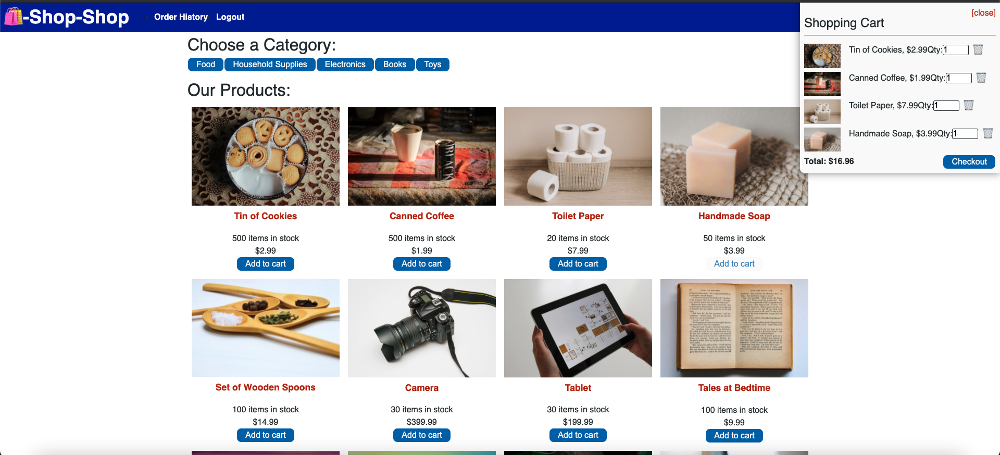
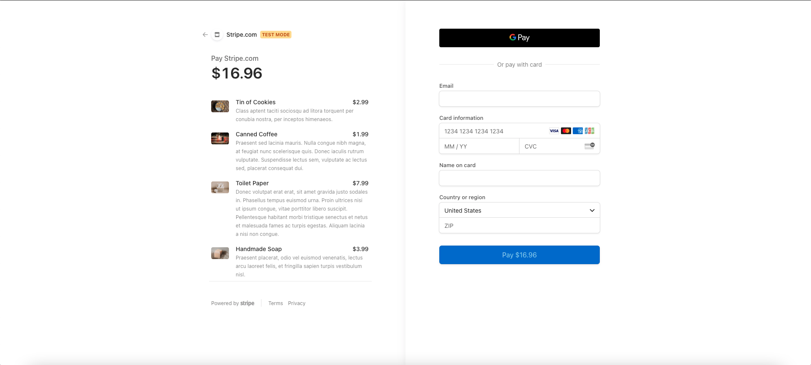
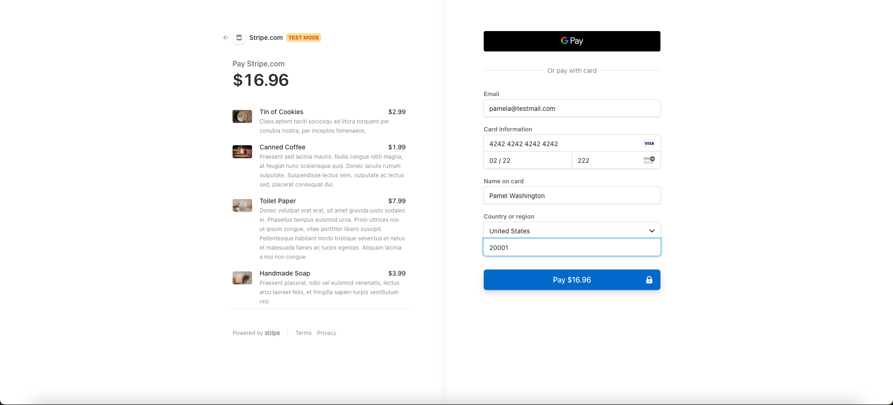
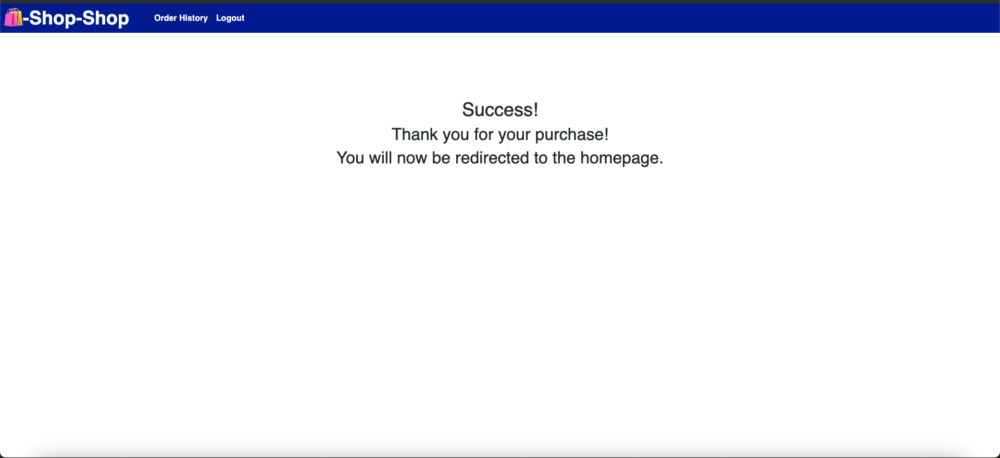
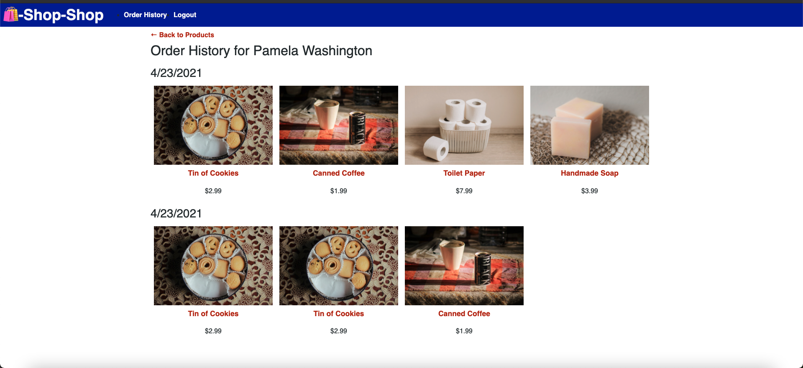

# Redux-Store
Week 22 - State Challenge: Redux Store


## Table of Contents

* [Description](#Description)
* [Requirements](#Requirements)
* [Installation](#Installation)
* [Usage](#Usage)
* [License](#License)
* [Badges](#Badges)
* [Issues](#Issues)
* [Technologies](#Technologies)
* [Screenshot](#screenshot)
* [Deployment](#deployment)
* [Contributing](#Contributing)
</br>
</br>

## Description
E-Commerce app with Stripe API refactored from MERN to Redux. 
<br>
<br>

## Requirements

#### User Story
>AS a senior engineer working on an e-commerce platform. I WANT my platform to use Redux to manage global state instead of the Context API. SO THAT my website's state management is taken out of the React ecosystem
<br>
<br>

>GIVEN an e-commerce platform that uses Redux to manage global state
<br>

>WHEN I review the app’s store
>>THEN I find that the app uses a Redux store instead of the Context API
<br>

>WHEN I review the way the React front end accesses the store
>>THEN I find that the app uses a Redux provider
<br>

>WHEN I review the way the app determines changes to its global state
>>THEN I find that the app passes reducers to a Redux store instead of using the Context API
<br>

>WHEN I review the way the app extracts state data from the store
>>THEN I find that the app uses Redux instead of the Context API
<br>

>WHEN I review the way the app dispatches actions
>>THEN I find that the app uses Redux instead of the Context API
<br>
<br>

## Installation
To use this application, please install: 
```
npm install
```

<br/>
<br/>

## Usage
In order to use the application, run the following commands:
```
npm start
```

<br/>
<br/>

## License 
[](https://opensource.org/licenses/MIT)
</br>
</br>

## Badges


</br>
</br>

## Issues
[](https://GitHub.com/jorgeebn16/redux-store/issues/)
[](https://GitHub.com/jorgeebn16/redux-store/issues?q=is%3Aissue+is%3Aclosed)
</br>
</br>

## Technologies
* [React](https://reactjs.org//)
* [npm](https://www.npmjs.com/)
* [MongoDB](https://www.mongodb.com/cloud/atlas)
* [JWT](https://jwt.io/)
* [GraphQL](https://graphql.org/)
* [ApolloServer](https://www.apollographql.com/docs/apollo-server/)
* [Redux](https://redux.js.org/)


<br/>
<br/>

## Screenshot
<br/><br/>
<br/><br/>
<br/><br/>
<br/><br/>
<br/><br/>
<br/><br/>
<br/><br/>

</br>
</br>

## Deployment
View [Deployed Portfolio](https://jorgeebn16-booksearching.herokuapp.com/)

## Contributing
[](https://GitHub.com/jorgeebn16/redux-store/graphs/contributors/)

For anyone who wishes to contribute you can contact me with at jorgeebn16@gmail.com
</br>
</br>

Would you like to reach me?
</br>
Contact Me:

Github: https://github.com/jorgeebn16</br>
Email: jorgeebn16@gmail.com


## Issues
[](https://GitHub.com/jorgeebn16/redux-store/issues/)
[](https://GitHub.com/jorgeebn16/redux-store/issues?q=is%3Aissue+is%3Aclosed)

